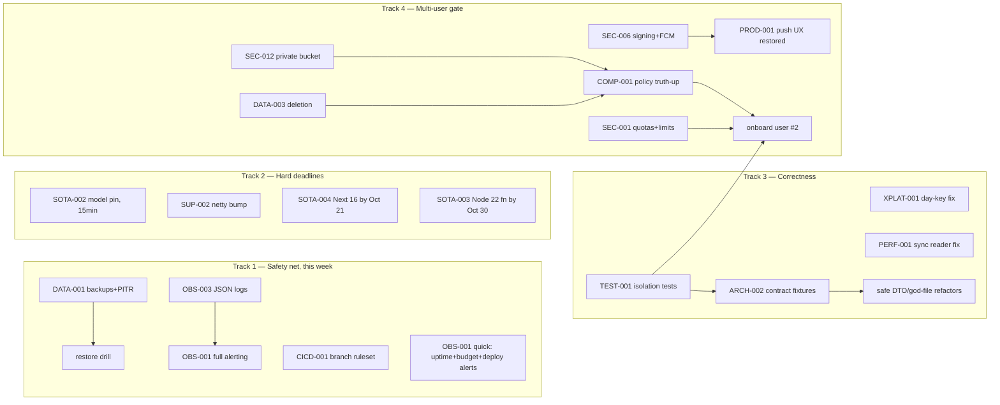

# Audit 2026-09-13 — Run #1

## BLUF

The code is in better shape than the operations around it: per-user scoping holds, the offline-first sync design is still the right call in 2026, and the Skeptic confirmed most of the architecture's load-bearing decisions — but production runs open-loop, with **no Firestore backup, no PITR, zero alert policies, no crash reporting, and a deploy pipeline that shipped a red-CI commit the same minute its tests failed** [Certain]. The single most important fact: a PHI-grade app has an unbounded RPO and no alarm that rings when anything breaks — every past silent incident (dead push, silent deploy failures, 401'd job queue, dropped sync entries) is the same root pattern, still open. Health verdict: **sound core, unsafe perimeter; fix the safety net before touching features**. This week's action: the one-day safety batch — enable Firestore backups+PITR, add uptime/deploy-failure/budget alerts, add a branch ruleset requiring green CI, pin the past-shutdown Gemini image model to its stable id, bump netty, and make the meal-photo bucket private. Everything else sequences behind that.

Counts: 162 findings (5 critical, 35 high, 65 medium, 57 low), 2 killed by the Skeptic, 19 merge clusters, 5 systemic patterns. Full machine-readable set: [`findings.json`](findings.json). Per-finding executable `prompt` fields are in `findings.json` — hand any ID back to a fresh agent session.

## Top 20 (total order, no ties)

| # | ID | Title | Sev | Conf | Effort (d) | Autonomy | Blocked by |
|---|---|---|---|---|---|---|---|
| 1 | DATA-001 | Prod Firestore has no backup schedule, PITR disabled, delete-protection off; GCS unversioned | critical | Certain | 0.5 | agent-reviewed | — |
| 2 | OBS-001 | Zero alert policies, uptime checks, dashboards, or notification channels in prod | critical | Certain | 1 | agent-reviewed | OBS-003 (severity-alerts only; uptime/budget/deploy alerts unblocked) |
| 3 | CICD-001 | Nothing gates deploys: no branch protection; red-CI SHA provably shipped | critical | Certain | 0.5 | agent-reviewed | — |
| 4 | PERF-001 | Sync change reader re-enumerates all nutritionDays parents per page (unbounded listDocuments N+1) | critical | Certain | 1.5 | agent-reviewed | — |
| 5 | XPLAT-001 | "Today" computed 3 ways (web UTC / device-local / server-zone); evening web logs land on wrong day | critical | Certain | 1 | agent-reviewed | — |
| 6 | SOTA-002 | Prod image model `gemini-3.1-flash-image-preview` is past earliest-shutdown; stable id exists | high | Certain | 0.1 | agent-unattended | — |
| 7 | SEC-012 | Meal-photo GCS bucket is public-read (allUsers objectViewer) | high | Certain | 0.5 | agent-reviewed | — |
| 8 | SUP-002 | netty pin 4.1.137 superseded (4.1.138 fixes ~23 CVEs); next backend merge trips Trivy gate | high | Certain | 0.1 | agent-unattended | — |
| 9 | SEC-001 (M5: +COST-003, OBS-010) | No rate limit, quota, or budget on Gemini spend paths with open signup | high | Certain | 1.5 | agent-reviewed | — |
| 10 | COST-001 | `--no-cpu-throttling` + sync keepalive burns ~$75/mo idle; joint decision with PERF-002 cold starts | high | Certain | 0.5 | operator-required (cost/latency tradeoff) | — |
| 11 | OBS-003 | Plain-text stdout logs: no Cloud Logging severities, no trace correlation, split stack traces | high | Certain | 1 | agent-reviewed | — |
| 12 | OBS-002 | No crash/error reporting from any client (android, wear, web) | high | Certain | 1.5 | agent-reviewed | COMP §4 doc update (sub-processor) |
| 13 | SOTA-004 | Next.js 15 EOL 2026-10-21; migrate to 16.x | high | Certain | 1.5 | agent-reviewed | — |
| 14 | SOTA-003 (M15: +SUP-005) | exercise-thumbnails on Node 20; GCF decommission 2026-10-30 | high | Certain | 0.5 | agent-reviewed | — |
| 15 | SEC-006 (M4: +CICD-004) | Debug-keystore signing + Firebase App Distribution channel; same root as dead FCM | high | Certain | 1 | operator-required (Firebase console + key decision) | — |
| 16 | COMP-001 | Published privacy policy promises deletion/isolation/no-training the system doesn't deliver | high | Certain | 1 | agent-reviewed | SEC-012, DATA-003 (or edit policy first) |
| 17 | ARCH-002 (M6: +TEST-005, DATA-008, OBS-005, ARCH-003, XPLAT-005) | Cross-layer contracts exist only as convention; the bug class has shipped twice | high | Certain | 3 | agent-reviewed | — |
| 18 | TEST-001 | Zero API-layer cross-user isolation tests despite open signup | high | Certain | 1.5 | agent-unattended | — |
| 19 | DATA-003 (M7) | Account deletion unbuilt; full checklist artifact exists in D5 report | high | Certain | 3 | agent-reviewed | — |
| 20 | UX-003 (in M11 with PROD-002) | Web nutrition day renders fetch failure as a zero-calorie "empty day"; first-run shows error-styled dashboard | high | Certain | 1 | agent-unattended | — |

Near-misses (21–25): SUP-001/M16 Spring Boot 4.1 migration (high, quarter-scale, see MIG-003), TEST-004/M18 UAT suite rot, COST-002 image-gen unit economics, PERF-003 serial all-users jobs, PERF-004 request-thread Gemini blocking.

## Systemic patterns

1. **Silent failure is the default failure mode** (24 findings — OBS-004/005/006/008, CICD-005, UX-003/005, DATA-008, `|| true`, `runCatching{}.getOrNull()`, `.catch(()=>null)`, `SKIPPED->Unit`). Root cause: error paths written for a solo operator who "would notice." Highest-leverage intervention: OBS-001+OBS-003, then a repo convention: no swallowed error without a counter or log.
2. **Cross-layer contracts exist only as convention** (13 — ARCH-002 cluster, XPLAT-002/-005, TEST-005). The platform /v1 API already has the snapshot+oasdiff pattern; it was never applied inward. Intervention: contract fixtures between backend emitted-collections/DTOs and android CollectionRegistry/Moshi DTOs.
3. **Infra knowledge lives outside the repo** (14 — DX-001/003, CICD-006, declared-but-unapplied terraform, manual index deploys, memory-resident runbooks). Intervention: an in-repo `docs/runbooks/` + terraform reconciliation.
4. **The last mile is unowned** (16 — dead FCM with notification-promising UX, placeholder legal URLs, TBD LICENSE, `0.0.2-SNAPSHOT`, wear hello-world, zero-consumer OAuth API). Intervention: a "ship-it checklist" gate per feature: distribution, links, version, telemetry.
5. **Single-user assumptions are load-bearing while signup is open** (12 — SEC-001, TEST-001, PROD-002, COST-003, COMP-001/002). Intervention: fail-closed signup allowlist until the user-#2 checklist (deletion, policy truth, quotas, isolation tests) is green.

## Sequencing

What unblocks what; three parallel tracks (safety, deadlines, correctness) plus a gated multi-user track:

**This week** (≈2 days): #1–8 (the safety batch + two one-liners + model pin + bucket). **This month**: #9–16 (observability pair, Next 16, Node 22, compute-cost decision, signing/FCM restore, policy truth-up) + XPLAT-001 + PERF-001. **This quarter**: #17–20 (contract fixtures, isolation tests, deletion, empty-state fixes), Boot 4.1 (MIG-003), UAT decision (fix into CI or archive), god-file splits behind the new tests. **Someday / conditional**: Better Auth (MIG-004 — trigger: Auth.js stops patching or breaks on a Next major), SQLCipher artifact migration (trigger: Play distribution intent), version negotiation XPLAT-002 (trigger: >5 real devices), i18n/dark-mode/a11y-primitives (trigger: public launch), OAuth platform mothball (trigger: still zero consumers at next audit).

## Do not change

Full list with reasoning in [`domains/01-architecture.md`](domains/01-architecture.md); binding highlights:

- **The offline-first bespoke sync engine.** D12 verified 2026 alternatives (PowerSync no Firestore backend; ElectricSQL pivoted); the LWW mirror + outbox is still the right call. Don't adopt a sync platform.
- **ConflictResolver's server-clock LWW invariant** and **terminal-4xx outbox parking** — both encode shipped-bug lessons; changing clock source or retry semantics re-opens closed incident classes.
- **Successor-chain refresh rotation without grace on the platform surface** (ADR-0019/0020) — deliberate, documented, correct.
- **Fail-closed admin defaults** (empty ADMIN_EMAILS = no admins) — keep fail-closed even though it's occasionally inconvenient.
- **No collectionGroup queries** — it's the tenant-isolation backstop; PERF fixes must not introduce them.
- **Single-module backend** — the 5→1 collapse is documented and correct for one operator; don't re-modularize.
- **JUnit4 on Android unit tests, FCM HTTP v1, strong-skipping defaults** — all verified current; no churn.
- **The heavy in-code explanatory comments and per-component CLAUDE.md files** — they are the agent-leverage infrastructure; any refactor must preserve them.
- **runAsync/request-lifecycle ordering in the backend** — COST-001's fix must sequence around it (see the finding's prompt), not delete it.

## Files

`findings.json` (machine-readable, stable IDs) · `baseline.json` · `domains/01–16` · `migrations/MIG-001..004` · `reconciliation.md` · `reaping-plan.md` (Phase 4, unexecuted) · `APPENDIX-REJECTED.md` · `APPENDIX-HYPOTHESES.md` (81 hypotheses with confirmation methods) · `DIFF.md` (run #1 baseline).
