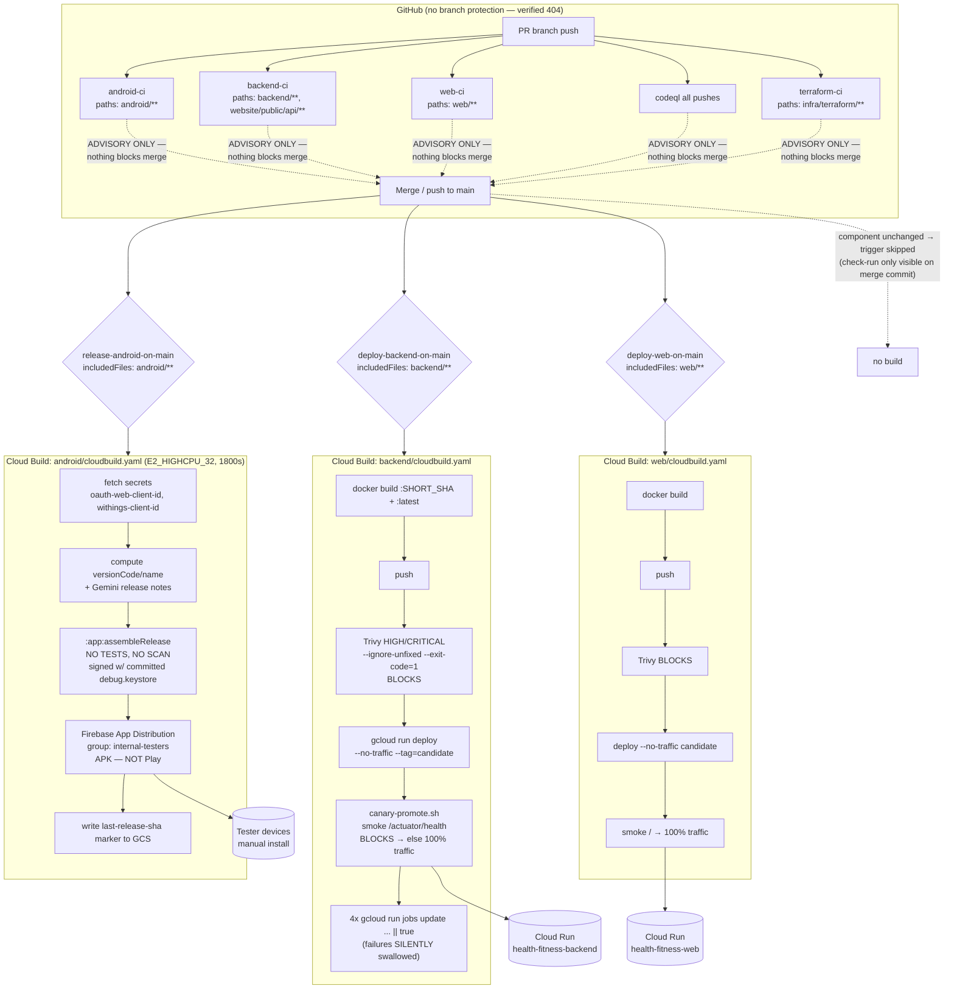

# D11 — CI/CD & Release Engineering (CICD)

Auditor: D11 · Date: 2026-09-13 · Repo: `gte619n/tesseta` · GCP: `health-fitness-160` · REGULATED MODE: ON (privacy scope)

## BLUF

Deploys are triggered by *any push to main*, path-filtered, with **zero gating on CI results and zero branch protection** (verified live: `gh api .../branches/main/protection` → 404 "Branch not protected"). This is not theoretical: commit `15ecf18` (#246) failed `android-ci` on main at 2026-09-13T19:57 and `release-android-on-main` **succeeded and distributed that same SHA** to testers at 19:57. The only gates that actually block shipping are inside Cloud Build itself: Trivy image scan (backend/web), the canary smoke test, and plain build failure. The Android release pipeline runs **no tests at all** and distributes via **Firebase App Distribution APKs signed with the checked-in debug keystore — this app is not on Play** (the shared-context assumption "Play-distributed" is wrong per the pipeline evidence). Rollback for Cloud Run is real and scripted (traffic-shift to previous revision; runbook exists); Android has explicitly no rollback. Highest-leverage fixes, in order: (1) minimal branch protection + always-reporting checks, (2) run Android unit tests in the release pipeline, (3) defuse the versionCode fallback landmine, (4) remove the four `|| true` job-update mufflers, (5) reconcile the trigger-SA IaC drift before anyone re-runs the import script.

## Pipeline topology



**What gates what, precisely:**

- Merge gate: **nothing**. `gh api repos/gte619n/tesseta/branches/main/protection` → `{"message":"Branch not protected","status":"404"}` [Certain].
- Deploy trigger: push to `^main$` + path filter only — `infra/triggers/backend.yaml:7-11` (`push: branch: ^main$` / `includedFiles: - backend/**`), same shape in `web.yaml`, `android.yaml`; confirmed identical in the live trigger list via `cloudbuild.googleapis.com/v1/projects/health-fitness-160/triggers` [Certain].
- Blocks inside the pipeline (the *only* real gates):
  - Trivy: `backend/cloudbuild.yaml:28-35` and `web/cloudbuild.yaml:25-32` (`--severity=HIGH,CRITICAL --ignore-unfixed --exit-code=1`).
  - Canary smoke: `infra/scripts/canary-promote.sh:25-40` — 30×3s poll of the zero-traffic `candidate` tag; on failure "Traffic UNCHANGED; not promoting" (line 39) and the build goes red with prod untouched.
  - Build/compile failure itself.
- **Ships despite being red in CI**: failing unit tests (all three components), web e2e/lint/typecheck/`pnpm audit` (`web-ci.yml:36-70`), CodeQL findings, the OpenAPI breaking-change gate (`backend-ci.yml:64-91`), terraform validate. Android additionally ships with **no test execution anywhere in its release path** (see CICD-002).

## Findings

---

### CICD-001 — No branch protection and CI does not gate deploys; red-test commits ship to prod/testers within minutes
- **Severity:** Critical · **Confidence:** [Certain] · **Effort:** 0.5 days · **Autonomy:** operator-assisted (repo settings + small workflow edits)
- **Evidence:**
  - `gh api repos/gte619n/tesseta/branches/main/protection` → HTTP 404 `"Branch not protected"` (fetched this audit).
  - `infra/triggers/backend.yaml:7-9`: `push:\n    branch: ^main$` — trigger fires on the push event alone; no check-run condition exists in Cloud Build GitHub-push triggers.
  - Live proof of a red build shipping: GitHub run `android-ci failure main 2026-09-13T19:57:03Z` (commit `15ecf18`, PR #246 — whose PR-branch `android-ci` also failed) vs Cloud Build `SUCCESS release-android-on-main 15ecf18 2026-09-13T19:57 702s` — the APK for a commit with failing unit tests was built and distributed.
  - Operator memory (citable): silent deploy failures for weeks; deploy check-runs visible only on merge-commit check-runs.
- **Impact:** In a regulated-privacy health app, any merge — including one with failing tests, failing CodeQL, or a breaking `/v1` API change — reaches prod (backend/web after only a liveness smoke) or testers (Android, no gate at all). The failure mode is asymmetric: CI is fast and green-looking on the PR page while the deploy outcome lives on a different commit's checks.
- **Fix (minimal-ceremony for a solo operator), assessed options:**
  1. *Cloud Build trigger requiring green checks:* not supported natively for GitHub-push triggers; would require rebuilding triggers as GitHub-app pull-request triggers or a gating first build step that queries the Checks API with a token. Most moving parts — reject.
  2. *Gate deploy on the CI workflow* (make deploys a `workflow_run`-chained GH Action calling `gcloud builds submit`): works but moves deploy credentials into GitHub and rewrites the deploy rail — heavy.
  3. **Recommended: branch protection (or a ruleset) on `main` requiring `android-ci`, `backend-ci`, `web-ci` + converting each workflow's path filter into an in-workflow early-exit** (e.g. `dorny/paths-filter` or a first job that computes changed paths and lets the remaining jobs no-op green), so required checks always report and never wedge a docs-only PR. Solo-friendly: no review requirement, allow self-admin bypass off, force-push protection on. ~half a day, zero recurring ceremony.
- **Null option cost:** every future "why is prod broken" incident keeps the current shape: broken commit deploys, discovery lags by hours/days (already experienced per operator memory), and the audit trail for a privacy-regulated app shows tested-status and shipped-status as unlinked.
- **Prompt:** "In gte619n/tesseta, enable a GitHub ruleset on main requiring status checks android-ci, backend-ci, web-ci. Modify .github/workflows/{android,backend,web}-ci.yml to remove `paths:` triggers and instead add a first `changes` job using dorny/paths-filter with the same path lists; make the heavy jobs `needs: changes` and `if:` the filter output, so each workflow always reports success quickly when its component is untouched. Do not add review requirements."

---

### CICD-002 — Android release pipeline runs zero tests and zero scanning before distributing
- **Severity:** High · **Confidence:** [Certain] · **Effort:** 0.5 days · **Autonomy:** full
- **Evidence:** `android/cloudbuild.yaml:166` — the only Gradle invocation is `./gradlew :app:assembleRelease --no-daemon`; no `testDebugUnitTest`, no lint gate beyond lint-vital baked into assembleRelease, no Trivy/dependency scan anywhere in the file. Contrast with CI, which runs the full multi-module unit suite (` .github/workflows/android-ci.yml:71-74`: `./gradlew testDebugUnitTest :app:checkDebugDuplicateClasses :wear:checkDebugDuplicateClasses`) — but per CICD-001 that result is advisory.
- **Impact:** Combined with CICD-001, the *only* thing standing between a failing-test commit and testers' phones is "does it compile under R8". Proven by `15ecf18` above. The health-data sync engine (SyncEngine/ConflictResolver/outbox suites, per android-ci.yml:59-61 comments) is exactly what those skipped tests gate.
- **Fix:** add `testReleaseUnitTest` (or `testDebugUnitTest`) to the build step in `android/cloudbuild.yaml` before `assembleRelease` (same warmed Gradle cache; recent builds run 480–856s with 1800s timeout, so headroom exists), or rely on CICD-001's branch protection as the single gate and accept pipeline-level trust in CI.
- **Null option cost:** each release is an untested binary; a broken sync/crash loop hits every tester (who are the production users of this app today) with no staged rollout to contain it.
- **Prompt:** "In android/cloudbuild.yaml step build-release-apk (line ~166), change the gradle command to `./gradlew testDebugUnitTest :app:assembleRelease --no-daemon` and verify the 1800s timeout still holds given recent 8–14min builds on E2_HIGHCPU_32."

---

### CICD-003 — versionCode fallback is a one-way downgrade landmine (~1.49M vs commit-count 634)
- **Severity:** High · **Confidence:** [Likely] (mechanism certain; whether the fallback has ever fired is unverified) · **Effort:** 0.5 days · **Autonomy:** full
- **Evidence:** `android/cloudbuild.yaml:45-50`:
  ```
  COMMIT_COUNT="$(git -C /workspace rev-list --count HEAD 2>/dev/null || echo 0)"
  if [ "$$COMMIT_COUNT" -gt 1 ]; then VERSION_CODE="$$COMMIT_COUNT"
  else VERSION_CODE="$(( ( $(date -u +%s) - 1700000000 ) / 60 ))"
  ```
  and line 38: `git -C /workspace fetch --unshallow --quiet 2>/dev/null || true` — the unshallow that makes commit-count work is explicitly best-effort ("Network/auth may forbid it"). Current values: `git rev-list --count origin/main` = **634**; fallback today = `(now−1700000000)/60 ≈ 1,487,000`.
- **Impact:** if the unshallow ever fails once (transient network/auth in Cloud Build), that build gets versionCode ~1.49M. Every subsequent commit-count build (~634+) is a **downgrade**; Android refuses to install updates over it (`INSTALL_FAILED_VERSION_DOWNGRADE`) and Firebase App Distribution will show "latest" builds older than installed. Recovery requires either switching the scheme permanently to the time basis or having every tester uninstall (losing local Room data — a health-data loss event).
- **Fix:** make the two bases comparable — use the minutes-since-anchor form *always*, or `max(commit_count, floor)` with a persisted high-water mark in the GCS marker bucket (the `last-release-sha` rail at lines 74/225 already exists to hold it); fail the build loudly instead of falling back.
- **Null option cost:** zero until the first flaky unshallow, then a fleet-wide un-updatable install base with a data-loss recovery path.
- **Prompt:** "In android/cloudbuild.yaml compute-version, replace the dual versionCode scheme (commit count with minutes-since-1700000000 fallback) with a single monotonic scheme: read a high-water-mark integer from gs://health-fitness-160-android-releases/version-code, set VERSION_CODE=max(hwm+1, commit_count), write it back in distribute-firebase next to last-release-sha. Fail the build if neither git history nor the marker is readable."

---

### CICD-004 — Distribution reality: Firebase App Distribution APK signed with the committed debug keystore; no Play, no staged rollout, and a signature-migration trap
- **Severity:** High · **Confidence:** [Certain] · **Effort:** 2–4 days (migration design) · **Autonomy:** operator decision required
- **Evidence:**
  - `android/cloudbuild.yaml:2-4` (comment): "Release builds are signed with the committed android/debug.keystore, so no signing secrets are fetched here"; distribution at lines 206-210: `firebase appdistribution:distribute ... --groups "internal-testers"` — an **APK**, not an AAB; no `gcloud`/Play track anywhere.
  - `android/app/build.gradle.kts:125-136`: release `signingConfig = signingConfigs.getByName("debug")`, storeFile `../debug.keystore` (line 101).
  - Drift: `infra/scripts/setup-cloud-build-triggers.sh:10-11` and 111-114 still describe `android-release-keystore*` secrets and warn the distribute step "will fail" without a real release signing config — the pipeline has since regressed/diverged from that setup script's contract.
  - The shared audit context's "Android is Play-distributed" is **contradicted** by every artifact above.
- **Impact (release-engineering, signing implications — SEC owns the key exposure itself):**
  - No staged rollout of any kind: every distribute is instant-100% to all testers; a bad release's only mitigation is "distribute a corrected build" (`docs/reference/deployment.md:194`: "Android has no rollback — distribute a corrected build."). Hotfix latency is actually good (~10–14 min Cloud Build, no store review) — that's the upside of the current rail.
  - Signing migration is the trap: moving to a real release key (mandatory before any Play upload, and the right fix for the SEC finding) changes the APK signature, so **existing installs cannot upgrade in place** — every current user must uninstall/reinstall, losing local Room/DataStore state unless server sync is verified complete. Play App Signing enrollment later would fix this class permanently (upload key rotatable) but the *first* hop off debug.keystore is unavoidable breakage for the installed base.
  - Wear: the pipeline builds/ships only `:app:assembleRelease` (`android/cloudbuild.yaml:166`, artifact path line 232 = `app-release.apk` only); the `:wear:` module exists in CI (`android-ci.yml:74`) but **no wear artifact is ever distributed** — wear is effectively local-install only.
- **Fix:** decide the distribution end-state now (stay App-Distribution vs go Play). Either way: generate a real release keystore into Secret Manager (the `setup-android-signing.sh` script and secret names already exist), schedule the one-time signature break while the user base is a handful of testers (it only gets worse), pair it with a "sync-flush + reinstall" release note, and if Play is the goal, enroll Play App Signing on first upload and switch to AAB.
- **Null option cost:** the installed base grows on an unmigratable signature; every month of delay increases the blast radius of the inevitable key migration; no rollout containment for bad releases.
- **Prompt:** "Design the tesseta Android signing migration: from committed android/debug.keystore (build.gradle.kts release signingConfig=debug) to a Secret-Manager release keystore per infra/scripts/setup-android-signing.sh, including the uninstall/reinstall break for existing Firebase App Distribution testers, verification that server sync makes local data loss safe, and (optionally) first Play Console upload with Play App Signing + AAB. Produce the runbook, not code, first."

---

### CICD-005 — Four `gcloud run jobs update ... || true` steps silently strand Cloud Run Jobs on stale images
- **Severity:** Medium · **Confidence:** [Certain] · **Effort:** 0.5 days · **Autonomy:** full
- **Evidence:** `backend/cloudbuild.yaml:146-149, 161-164, 176-179, 192-195` — `gcloud run jobs update goals-sustained-reeval|gh-health-check|gh-refresh|withings-refresh --image=...:$SHORT_SHA ... || true`, justified in comments as bootstrap-safety ("fresh projects ... will fail this update cleanly"). Operator memory confirms this is a known pain.
- **Impact:** any *real* failure (IAM regression, quota, bad flag, deleted job) is indistinguishable from bootstrap-absence; the service moves to `$SHORT_SHA` while jobs keep running an older image sharing the same code contract (same jar, `backend/cloudbuild.yaml:131-134`). Tolerant-reader usually saves you until it doesn't (schema/DTO drift between service writes and job reads).
- **Fix:** replace `|| true` with an existence check: `if gcloud run jobs describe NAME ... >/dev/null 2>&1; then gcloud run jobs update ... ; else echo "job NAME not bootstrapped, skipping"; fi` — bootstrap stays safe, genuine update failures fail the build.
- **Null option cost:** next job-side incident presents as inexplicable stale behavior (e.g. gh-refresh pulling with retired credentials logic) with zero red signal at deploy time.
- **Prompt:** "In backend/cloudbuild.yaml, rewrite the four update-*-job steps to `gcloud run jobs describe` first and only swallow the not-found case; a failed update on an existing job must fail the build."

---

### CICD-006 — Trigger IaC drift: repo YAML says `tesseta-ci@`, live triggers run as the compute default SA; re-import would break deploys
- **Severity:** Medium · **Confidence:** [Certain] (drift itself) / [Likely] (that re-import breaks) · **Effort:** 0.5 days · **Autonomy:** full
- **Evidence:** `infra/triggers/backend.yaml:3` (and web/android): `serviceAccount: projects/health-fitness-160/serviceAccounts/tesseta-ci@health-fitness-160.iam.gserviceaccount.com`. Live (Cloud Build REST, fetched this audit): all three triggers report `"serviceAccount": "projects/health-fitness-160/serviceAccounts/146599669983-compute@developer.gserviceaccount.com"`. Meanwhile `infra/scripts/setup-cloud-build-triggers.sh:25` pins and grants roles to `${PROJECT_NUMBER}-compute@developer.gserviceaccount.com` — i.e. the *script* contradicts the *YAML it imports*.
- **Impact:** running the "idempotent" setup script (its stated purpose, lines 5-7) would flip the live triggers to `tesseta-ci@`, whose role grants are not managed anywhere visible in this repo — plausibly breaking all three deploy pipelines at the next merge, in the already-known silent-failure mode (CICD-001). Also a least-privilege note for SEC: builds currently run as the broad compute default SA.
- **Fix:** pick one SA (prefer a dedicated `tesseta-ci@` with exactly the roles the script grants), align YAML + script + live, and re-import once deliberately.
- **Null option cost:** a routine "re-run the bootstrap script" during any future incident quietly detonates the deploy rail.
- **Prompt:** "Reconcile infra/triggers/*.yaml serviceAccount (tesseta-ci@) with infra/scripts/setup-cloud-build-triggers.sh (grants to compute default SA) and the live triggers (compute default SA per Cloud Build API). Choose the dedicated SA, grant roles/run.admin, artifactregistry.writer, secretmanager.secretAccessor, firebaseappdistro.admin, iam.serviceAccountUser-on-runtime-SA to it, update both files, then re-import."

---

### CICD-007 — Hermeticity gaps: tag-pinned bases, mutable-at-build-time package fixes, unpinned `curl | bash` in the release path, no wrapper checksum
- **Severity:** Medium · **Confidence:** [Certain] · **Effort:** 1 day · **Autonomy:** full
- **Evidence:**
  - `web/Dockerfile:1,8,15`: `FROM node:22-alpine` (tag, no digest) ×3 stages; `backend/Dockerfile:2,13`: `eclipse-temurin:21-jdk` / `21-jre` (tag). `android/cloudbuild.yaml:145`: `cimg/android:2026.03.1` (specific tag — best of the lot); `aquasec/trivy:0.58.1` pinned by tag (`backend/cloudbuild.yaml:29`).
  - `web/Dockerfile:5-6`: `if [ -f pnpm-lock.yaml ]; then pnpm install --frozen-lockfile; else pnpm install --no-frozen-lockfile; fi` — the lockfile exists (`web/pnpm-lock.yaml` present) so today's builds are frozen, but a deleted/renamed lockfile silently degrades to floating resolution instead of failing. CI has no such fallback (`web-ci.yml:36`), so CI and the shipped image can diverge exactly when it matters.
  - `web/Dockerfile:25`: `RUN apk upgrade --no-cache libssl3 libcrypto3` — build output depends on the Alpine repo state at build time (deliberate CVE-gate workaround; makes rebuilds non-reproducible).
  - `android/cloudbuild.yaml:197`: `curl -sL https://firebase.tools | bash` — unpinned remote script executed at release time with Secret-Manager-capable credentials (supply-chain overlap with D3; the release-engineering angle: a firebase.tools outage or compromise breaks/poisons releases).
  - No `distributionSha256Sum` in either `backend/gradle/wrapper/gradle-wrapper.properties:3` (gradle-9.6.1) or `android/.../gradle-wrapper.properties:3` (gradle-8.11) — URL-pinned, not checksum-pinned.
  - GitHub Actions are commendably SHA-pinned throughout (e.g. `android-ci.yml:33`), so the gap is specifically the container/build-tool layer.
- **Impact:** identical commits can produce different images across days; the Trivy gate then blocks *later unrelated* merges on drift the operator didn't cause (already experienced — operator memory). The `curl | bash` is the single worst line for release integrity.
- **Fix:** digest-pin the three base images (Dependabot/renovate can bump digests), drop the `--no-frozen-lockfile` branch (fail if lockfile missing), pin firebase-tools (`npm i -g firebase-tools@X.Y.Z` in the cloud-sdk image or bake a builder image — the TODO at `android/cloudbuild.yaml:141-143` already proposes the custom builder), add `distributionSha256Sum`.
- **Null option cost:** recurring Trivy-blocked-deploy surprises; unauditable "what exactly did we ship" answers in a regulated context.
- **Prompt:** "Pin tesseta build inputs: digest-pin FROM lines in web/Dockerfile and backend/Dockerfile, remove the --no-frozen-lockfile fallback in web/Dockerfile, replace `curl -sL https://firebase.tools | bash` in android/cloudbuild.yaml with a version-pinned npm install of firebase-tools, and add distributionSha256Sum to both gradle-wrapper.properties."

---

### CICD-008 — Provenance is good (SHORT_SHA tags) but release *versioning* is vestigial: backend `0.0.2-SNAPSHOT`, floating `:latest`, no version endpoint story
- **Severity:** Low · **Confidence:** [Certain] · **Effort:** 0.5 days · **Autonomy:** full
- **Evidence:** images tagged `$SHORT_SHA` *and* `latest` (`backend/cloudbuild.yaml:12-14,197-199`; `web/cloudbuild.yaml:12-14,79-81`); Cloud Run revisions deploy by `$SHORT_SHA` (`backend/cloudbuild.yaml:46`), so "which commit serves prod" is answerable from the serving revision's image tag — genuine provenance. But `backend/build.gradle.kts:9`: `version = "0.0.2-SNAPSHOT"` — a constant; nothing stamps the SHA into the artifact itself, so from *inside* the app (logs, actuator info, error reports) the running version is unknowable. Android solved this exact problem for itself (versionName rail, `android/cloudbuild.yaml:27-60`).
- **Impact:** incident triage requires GCP console cross-referencing instead of reading a version from a log line/health endpoint; no human-meaningful release numbering exists for backend/web at all.
- **Fix:** pass `SHORT_SHA` as a docker build-arg → Spring `info.build.commit` env (surfaced at `/actuator/info`), same for web (`NEXT_PUBLIC_COMMIT`). Optionally stop pushing `:latest` (nothing in the deploy path needs it; it only invites "deploy latest" accidents).
- **Null option cost:** slower incident triage; ambiguous bug reports ("which build was that?") — mostly friction, not risk.
- **Prompt:** "Thread $SHORT_SHA into the backend and web images at build time (docker build-arg → env → /actuator/info and a web footer/meta), and evaluate dropping the :latest tags from both cloudbuild files."

---

### CICD-009 — Environment story: prod + two local modes, no staging; local dev shares the prod GCP project and real secrets; config parity is comment-enforced
- **Severity:** Medium · **Confidence:** [Certain] · **Effort:** n/a (accept + document) to 2 days (staging) · **Autonomy:** operator decision
- **Evidence:**
  - Environments that exist: prod (Cloud Run, `FIRESTORE_DATABASE_ID=production`, `backend/cloudbuild.yaml:96`); local **dev.sh** (`infra/scripts/dev.sh` — "Both hit real GCP services — Firestore (default) database, KMS via ADC, Secret Manager", pulls OAuth/Auth.js secrets from prod Secret Manager, exposes over Tailscale); local **uat.sh** (`infra/scripts/uat.sh:4-10` — "credential-free ... Firestore emulator ... NO gcloud secrets, NO Google sign-in, NO real Gemini call", Selenium suite in `uat/`, "intentionally NOT wired into CI"); plus `copy-production-to-default-firestore.sh` / `copy-default-to-production-firestore.sh` for data shuttling. No staging/UAT deployment target exists anywhere.
  - Spring profiles: **none** — `grep on-profile backend/src/main/resources/application.yml` → no matches; one `application.yml`, all prod divergence lives in the two giant `--set-env-vars`/`--set-secrets` blocks (`backend/cloudbuild.yaml:96,109`) whose *documentation is the YAML comments themselves* (lines 76-116).
  - The canary smoke (`/actuator/health`) is the only pre-traffic validation any config change ever gets.
- **Impact:** a missing/typo'd env var (the `BACKEND_URL` vs `BACKEND_BASE_URL` incident is memorialized at `web/cloudbuild.yaml:50-53`) is only catchable at deploy-time smoke, which checks liveness, not behavior. dev.sh writing to the *(default)* Firestore database in the *prod project* with prod secrets means "local testing" mutates real cloud state adjacent to prod data (privacy scope: real tokens/KMS on a dev laptop path). For a solo operator a full staging env is likely over-ceremony; the cheap wins are validation, not environments.
- **Fix (minimal):** (a) a startup env-contract check in the backend (fail fast listing missing required vars — turns config drift into a failed canary instead of a runtime 500), (b) promote the cloudbuild comments into a checked-in `docs/reference/env-contract.md` or typed `@ConfigurationProperties` with validation, (c) accept dev.sh as-is but note it in the privacy/data-map (D5 overlap).
- **Null option cost:** each new integration (Withings was the latest) re-risks the "deployed but misconfigured, smoke passed anyway" class.
- **Prompt:** "Add fail-fast configuration validation to the tesseta backend: typed @ConfigurationProperties with @Validated for every env var listed in backend/cloudbuild.yaml --set-env-vars/--set-secrets, so a missing var fails startup (and thus the canary) with a named error."

---

### CICD-010 — Rollback: Cloud Run rail is real but all-or-nothing and (as far as observable) never exercised; Android has none by design
- **Severity:** Low · **Confidence:** [Certain] on mechanics; [Likely] on "never exercised" · **Effort:** 0 (awareness) · **Autonomy:** n/a
- **Evidence:** promotion is instant-100% (`canary-promote.sh:31-32`: `update-traffic ... --to-tags=candidate=100`) — no gradual split ever. Rollback is scripted and documented: `infra/scripts/rollback.sh:27-28` (`--to-revisions="${PREVIOUS}=100"`), runbook at `docs/reference/deployment.md:183-194`, including "(Android has no rollback — distribute a corrected build.)" (line 194). Recent Cloud Build history shows failed deploys (`FAILURE deploy-web-on-main 0bb0afd`, `FAILURE deploy-backend-on-main 437c258`) that correctly left prod on the prior revision — the *canary* half is battle-tested; no evidence the *post-promotion* rollback has ever run.
- **Impact:** acceptable for the scale. The real dependency is noted correctly by the brief: schemaless Firestore means a rollback re-exposes old code to new-shape documents — the tolerant-reader discipline is the actual rollback safety mechanism and is untested by any gate. Bugs that pass the liveness smoke but corrupt data get 100% of traffic immediately.
- **Fix:** none urgent; optionally do one deliberate rollback drill (5 min) and note the result in the runbook.
- **Null option cost:** first real post-promotion rollback happens under incident pressure, untested.
- **Prompt:** "Run a rollback drill: deploy a trivial change, promote, execute infra/scripts/rollback.sh health-fitness-web, verify, roll forward; record timings in docs/reference/deployment.md."

---

### CICD-011 — Pipeline duration/cost: fine today; Android on E2_HIGHCPU_32 every merge is the only line item worth watching
- **Severity:** Low · **Confidence:** durations [Certain]; dollar figures [Guessing] (pricing page fetch returned truncated content — no rate citable, per R7) · **Effort:** 0–0.5 days · **Autonomy:** full
- **Evidence (fetched this audit):**
  - GitHub Actions wall-clock (recent runs): web-ci n/a in sample; backend-ci ~2 min (19:57:03→19:59:00); android-ci ~2–7 min; codeql ~5–6 min. All SHA-pinned runners, ubuntu-latest.
  - Cloud Build (last 25 builds): `release-android-on-main` 480–856s (median ~700s ≈ 11.7 min) on `E2_HIGHCPU_32` (`android/cloudbuild.yaml:240`, `timeout: 1800s:242`); `deploy-backend-on-main` 345–605s on default machine; `deploy-web-on-main` 200–405s default.
  - Cadence: 54 first-parent commits to main in the last 30 days (`git log origin/main --since="30 days ago" --first-parent | wc -l`).
- **Estimate:** at ~54 merges/mo with most touching android/, roughly 400–550 E2_HIGHCPU_32 build-minutes + ~300 default-machine minutes monthly. At published Cloud Build per-minute rates this is plausibly low-tens-of-dollars/month [Guessing — rate not verified]; the Gradle GCS cache (`android/cloudbuild.yaml:126-186`) is already the right optimization and is working (480s warm vs 856s cold spread).
- **Fix/watch:** nothing required; if cost appears, the TODO'd custom builder image (`android/cloudbuild.yaml:141-143`) would shave the cimg pull + chown tax.
- **Null option cost:** negligible.
- **Prompt:** "Pull last-90-day Cloud Build minutes by machine type for health-fitness-160 via the billing export and confirm the android E2_HIGHCPU_32 spend is <$50/mo; if not, bake the custom builder image per the TODO in android/cloudbuild.yaml."

---

### CICD-012 — Branch/merge strategy: PR ceremony without PR protection — keep the PRs, add the gate, skip the rest
- **Severity:** Low · **Confidence:** [Certain] · **Effort:** 0 (policy) · **Autonomy:** operator decision
- **Evidence:** history is PR-numbered squash-style merges (`29d8289c ... (#247)`, `15ecf188 ... (#246)` etc.) off feature branches/worktrees; no protection (CICD-001) means the PR is pure convention. CI runs twice per change (branch push + main push — e.g. `android-ci` ran on both `fix-app-unit-test-log` and `main` for #247 within minutes), which is the correct price for main-status truth given caches are main-seeded (`android-ci.yml:52`).
- **Assessment:** for a solo operator the PR flow is *earning its keep* — it's the unit of release notes (`android/cloudbuild.yaml` Gemini notes summarize commit subjects), the anchor for check-runs, and the memory trail. Merge queue: pointless at ~2 merges/day, single author. Self-review requirement: pure ceremony — skip. The only missing piece is the required-checks gate (CICD-001); with that, current ceremony level is right-sized. One convention worth adding: since deploy check-runs attach to the merge commit, glance at the merge commit's checks (or use the loop/babysit pattern) after backend-touching merges — this is the operator's known pain and costs nothing to formalize in `docs/reference/deployment.md`.
- **Prompt:** n/a (subsumed by CICD-001).

## HYPOTHESES (unverified)

- H1: `tesseta-ci@health-fitness-160` may not exist or may lack deploy roles — I could not read IAM (did not attempt policy read; out of read-only comfort for this audit). If it exists with roles, CICD-006's re-import risk drops to Low.
- H2: The versionCode fallback (CICD-003) may already have fired in an early build; if any distributed build shows a 7-digit build number in Firebase App Distribution history, current 634-range builds are *already* un-installable as updates for anyone on it.
- H3: `web-ci` ~2 min per shared context vs the heavyweight step list (Playwright e2e, build, coverage — `web-ci.yml:36-78`) suggests either good caching or e2e running against a trivially small suite; no recent web-ci run appeared in the sampled window to verify.
- H4: Cloud Build dollar cost — no rate could be fetched (pricing page content truncated); the monthly estimate is order-of-magnitude only.
- H5: `terraform-ci` validates but nothing applies IaC automatically; live-vs-repo drift like CICD-006 is therefore likely present in other Terraform-managed resources too (D-infra overlap; not enumerated here).

```json
[
  {"id":"CICD-001","title":"No branch protection; CI does not gate deploys — red-test commits ship","severity":"critical","confidence":"certain","effort_days":0.5,"autonomy":"operator-assisted","files":["infra/triggers/backend.yaml:7-11",".github/workflows/android-ci.yml:3-12"],"evidence":"gh api branches/main/protection → 404 'Branch not protected'; android-ci FAILURE on main for 15ecf18 at 2026-09-13T19:57 while release-android-on-main SUCCESS distributed same SHA","null_option_cost":"broken commits keep deploying; tested-status and shipped-status unlinked in a regulated app"},
  {"id":"CICD-002","title":"Android release pipeline runs zero tests and zero scanning","severity":"high","confidence":"certain","effort_days":0.5,"autonomy":"full","files":["android/cloudbuild.yaml:166"],"evidence":"only gradle invocation is ':app:assembleRelease --no-daemon'; no test/Trivy step in file","null_option_cost":"every release is an untested binary reaching all testers instantly"},
  {"id":"CICD-003","title":"versionCode fallback creates permanent downgrade landmine (~1.49M vs 634)","severity":"high","confidence":"likely","effort_days":0.5,"autonomy":"full","files":["android/cloudbuild.yaml:38-50"],"evidence":"unshallow is '|| true'; fallback (epoch-1700000000)/60 ≈ 1,487,000 vs rev-list count 634","null_option_cost":"one flaky fetch makes all future builds uninstallable updates; recovery = fleet uninstall (local data loss)"},
  {"id":"CICD-004","title":"Firebase App Distribution APK with debug-keystore signing; not on Play; signing-migration breaks installed base","severity":"high","confidence":"certain","effort_days":3,"autonomy":"operator-decision","files":["android/cloudbuild.yaml:2-4,206-210","android/app/build.gradle.kts:125-136","docs/reference/deployment.md:194"],"evidence":"release signingConfig=debug (../debug.keystore); distribute --groups internal-testers; 'Android has no rollback'","null_option_cost":"installed base grows on unmigratable signature; no rollout containment"},
  {"id":"CICD-005","title":"Four '|| true' Cloud Run job updates swallow real failures","severity":"medium","confidence":"certain","effort_days":0.5,"autonomy":"full","files":["backend/cloudbuild.yaml:146-149,161-164,176-179,192-195"],"evidence":"gcloud run jobs update ...|| true ×4 (goals-sustained-reeval, gh-health-check, gh-refresh, withings-refresh)","null_option_cost":"jobs silently pinned to stale images until an incident"},
  {"id":"CICD-006","title":"Trigger SA drift: repo YAML tesseta-ci@ vs live compute-default SA vs setup script grants","severity":"medium","confidence":"certain","effort_days":0.5,"autonomy":"full","files":["infra/triggers/backend.yaml:3","infra/scripts/setup-cloud-build-triggers.sh:25"],"evidence":"live triggers (Cloud Build API) run as 146599669983-compute@developer; YAML declares tesseta-ci@; script grants roles to compute default","null_option_cost":"re-running the idempotent import script plausibly breaks all deploys"},
  {"id":"CICD-007","title":"Hermeticity gaps: tag-pinned bases, apk-upgrade drift, curl|bash firebase.tools in release path, no gradle wrapper checksum","severity":"medium","confidence":"certain","effort_days":1,"autonomy":"full","files":["web/Dockerfile:1-6,25","backend/Dockerfile:2,13","android/cloudbuild.yaml:197","backend/gradle/wrapper/gradle-wrapper.properties:3"],"evidence":"FROM node:22-alpine (no digest); --no-frozen-lockfile fallback; curl -sL https://firebase.tools | bash; no distributionSha256Sum","null_option_cost":"recurring Trivy-blocked deploys on drift; unauditable rebuilds"},
  {"id":"CICD-008","title":"Good SHA provenance but vestigial versioning (0.0.2-SNAPSHOT, :latest tags, no in-app version)","severity":"low","confidence":"certain","effort_days":0.5,"autonomy":"full","files":["backend/build.gradle.kts:9","backend/cloudbuild.yaml:12-14"],"evidence":"version = \"0.0.2-SNAPSHOT\"; images tagged SHORT_SHA+latest; nothing stamps SHA into artifact","null_option_cost":"slower incident triage"},
  {"id":"CICD-009","title":"No staging; dev.sh uses prod project + real secrets; env contract enforced only by cloudbuild comments","severity":"medium","confidence":"certain","effort_days":1,"autonomy":"operator-decision","files":["infra/scripts/dev.sh","infra/scripts/uat.sh:4-10","backend/cloudbuild.yaml:96,109"],"evidence":"dev.sh: 'Both hit real GCP services — Firestore (default) database'; no Spring profiles in application.yml; env vars documented only in YAML comments","null_option_cost":"config typos survive to deploy-time liveness smoke (BACKEND_URL incident already memorialized)"},
  {"id":"CICD-010","title":"Rollback scripted+documented but instant-100% promote, likely never exercised; Android none by design","severity":"low","confidence":"certain","effort_days":0.1,"autonomy":"full","files":["infra/scripts/canary-promote.sh:31-32","infra/scripts/rollback.sh:27-28","docs/reference/deployment.md:183-194"],"evidence":"--to-tags=candidate=100; rollback.sh --to-revisions=PREVIOUS=100; runbook exists","null_option_cost":"first real rollback happens untested under incident pressure"},
  {"id":"CICD-011","title":"Duration/cost healthy; android E2_HIGHCPU_32 ~700s median per merge is only watch item","severity":"low","confidence":"certain","effort_days":0.25,"autonomy":"full","files":["android/cloudbuild.yaml:240-242"],"evidence":"last-25 builds: android 480-856s E2_HIGHCPU_32, backend 345-605s default, web 200-405s; 54 merges/30d","null_option_cost":"negligible"},
  {"id":"CICD-012","title":"PR ceremony without PR protection — keep PRs, add required checks, skip review/merge-queue ceremony","severity":"low","confidence":"certain","effort_days":0,"autonomy":"operator-decision","files":["docs/reference/deployment.md"],"evidence":"squash PRs (#244-247) with no protection; deploy check-runs attach to merge commit only","null_option_cost":"subsumed by CICD-001"}
]
```
